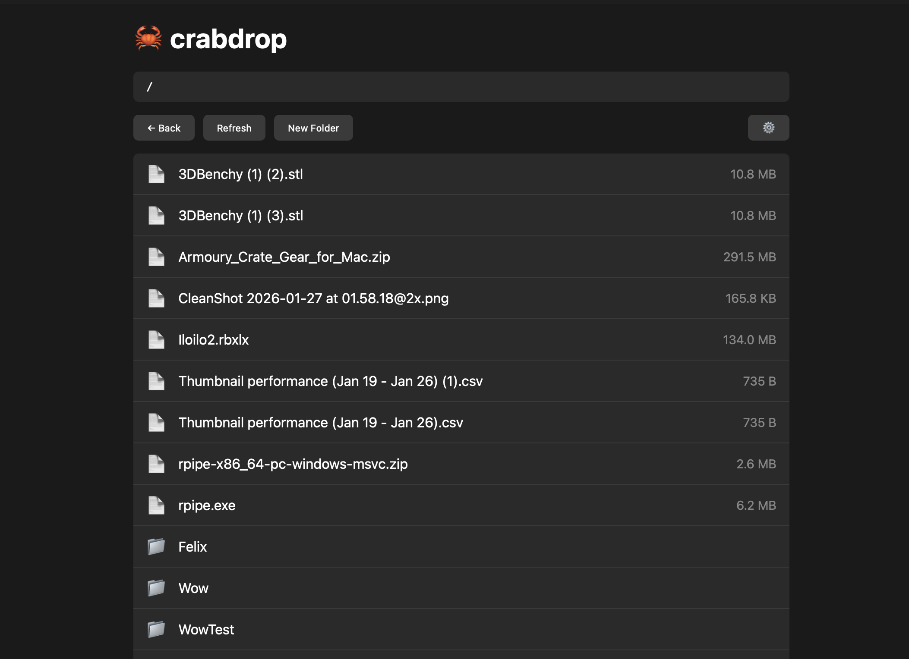

# 🦀 crabdrop

A simple, fast file manager for S3-compatible storage.



## Features

- Browse, upload, and download files
- Drag and drop uploads
- Multipart upload for large files (100MB+)
- Folder upload support
- Upload progress tracking
- Works with AWS S3, Cloudflare R2, MinIO, and any S3-compatible service

## Installation

### macOS / Windows / Linux

Download the latest release from [GitHub Releases](https://github.com/alsofelix/crabdrop/releases).

| Platform | Download |
|----------|----------|
| macOS (Apple Silicon) | `.dmg` |
| macOS (Intel) | `.dmg` |
| Windows | `.msi` or `.exe` |
| Linux | `.deb` or `.AppImage` |

### Flathub

Coming soon.

## Building from source

Requires [Rust](https://rustup.rs/), [Node.js](https://nodejs.org/), and [Bun](https://bun.sh/).
```bash
git clone https://github.com/alsofelix/crabdrop.git
cd crabdrop
bun install
cd src-tauri
cargo tauri build
```

## License

MIT